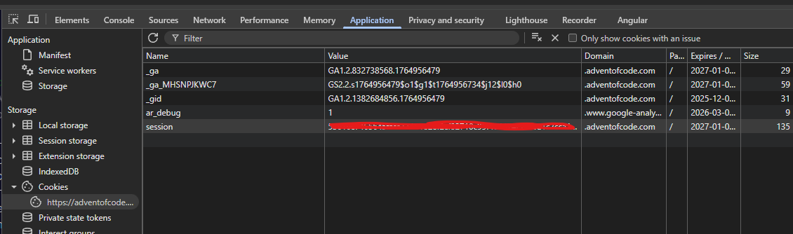

# Advent of Code 2025

## Setup

### Install dependencies

    uv sync

### Login to advent of code

    Go to: https://adventofcode.com/ and login with your account

### Get AOC token from browser cache

1) Open Chrome DevTools > Application > Cookies:
2) Copy the value of the session cookie



3) Run the following commands:

    ### Linux/macOS
    ```bash
    mkdir -p ~/.config/aocd
    echo "[session-cookie-value]" > ~/.config/aocd/token 
    ```
    
    ### Windows
    Need to ensure that the file uses the correct encoding.
    ```PowerShell
    mkdir "$HOME\.config\aocd" -Force
    "[session-cookie-value]" | Out-File -FilePath  ~\.config\aocd\token -Encoding ascii
    ```            

### Generate all files using the template

    uv run generate

## Usage

### Test solution against the examples

    uv run test [DAY]

### Solve puzzle

    uv run solve [DAY]

